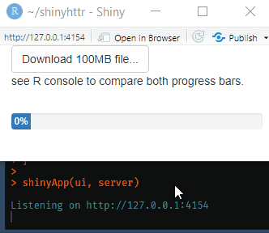

<!-- README.md is generated from README.Rmd. Please edit that file -->

# shinyhttr

For now, the goal of shinyhttr is to integrate httr::progress with
shinyWidgets::progressBar.

In practice, the difference will be

``` r
# from this
httr::GET("http://download.com/some_heavy_file.txt", progress())


# to this
httr::GET("http://download.com/some_heavy_file.txt", progress(session, id = "my_progress_bar1"))
```



## Installation

``` r
devtools::install_github("curso-r/shinyhttr")
```

## Example

``` r
library(shiny)
library(shinyWidgets)
library(httr)
library(shinyhttr)

ui <- fluidPage(

  sidebarLayout(

    NULL,

    mainPanel(
      actionButton('download', 'Download 100MB file...'),
      tags$p("see R console to compare both progress bars."),
      progressBar(
        id = "pb",
        value = 0,
        title = "",
        display_pct = TRUE
      )
    )
  )
)

server <- function(input, output, session) {
  observeEvent(input$download, {
    GET(
      url = "https://speed.hetzner.de/100MB.bin",
      shinyhttr::progress(session, id = "pb") # <- the magic happens here. progress() now has session and id args
    )
  })
}

shinyApp(ui, server)
```
